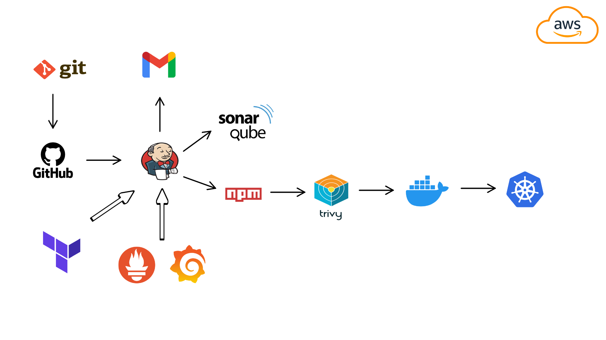
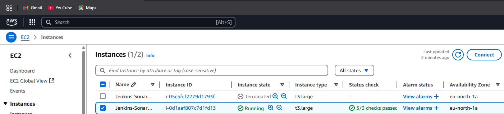
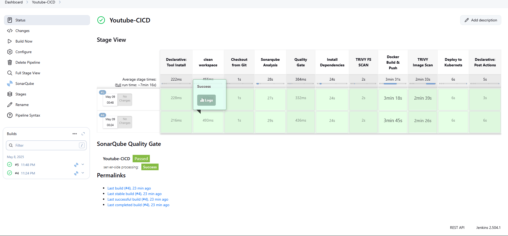
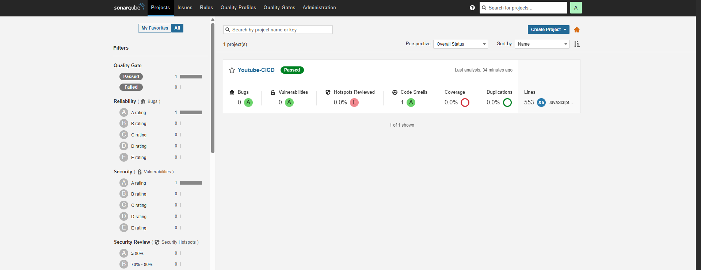
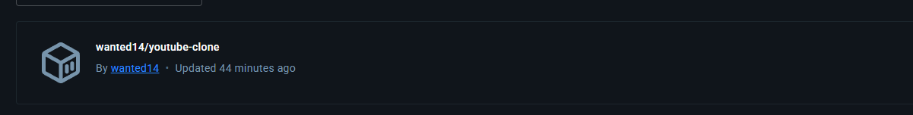
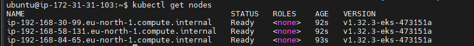
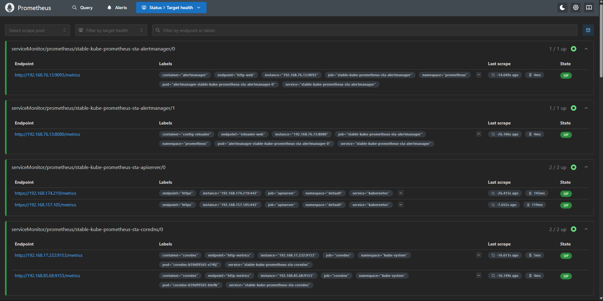
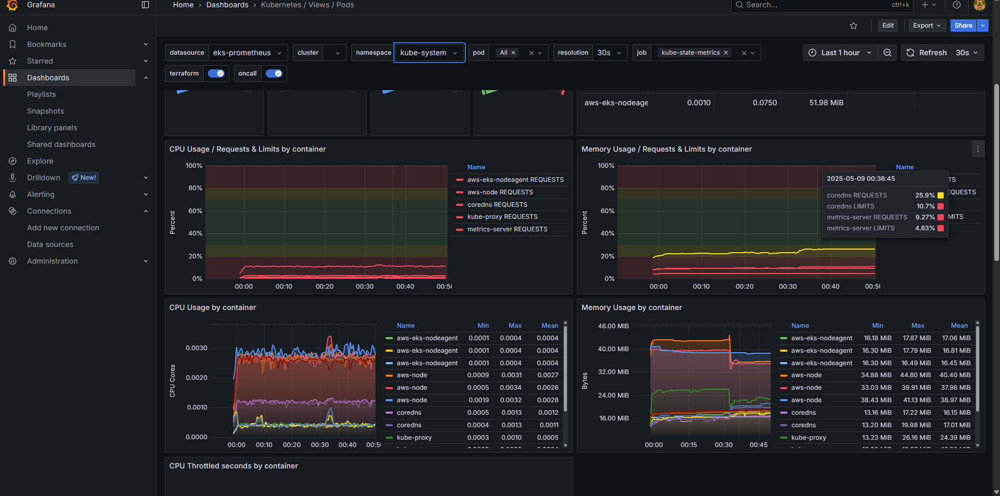
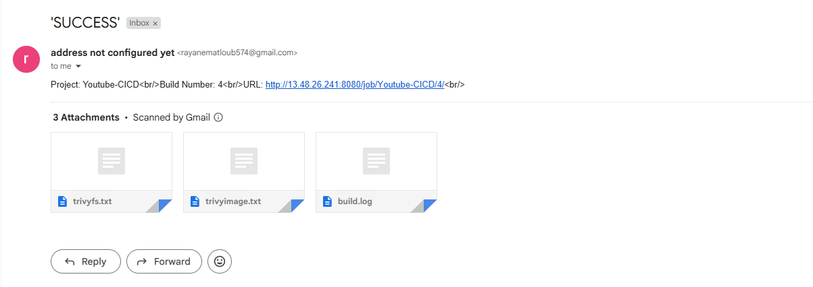
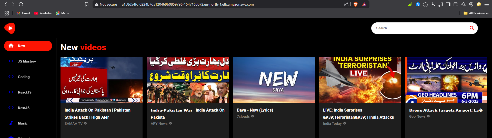

# 🚀 Projet DevOps : CI/CD Automatisé pour l'Application YouTube Clone


Bienvenue dans ce projet DevOps illustrant une chaîne complète CI/CD pour le déploiement d’un clone de YouTube, intégrant des outils d’analyse, de sécurité, de conteneurisation, de monitoring et de notification.

---

## 🧩 Aperçu du Projet

Ce projet comprend :

1. **Application YouTube Clone** : [Lien GitHub](https://github.com/wnteed/youtube-clone)

L’objectif est de créer un pipeline automatisé : du code à la production sur un cluster Kubernetes (AWS EKS), avec suivi qualité, sécurité et monitoring intégré.

---

## 🛠️ Technologies Utilisées

- **GitHub** : Code source
- **Jenkins** : Orchestration des pipelines CI/CD
- **SonarQube** : Analyse statique du code
- **Trivy** : Scans de vulnérabilité (code et images Docker)
- **Docker** : Conteneurisation
- **Docker Hub** : Registry d’images
- **Kubernetes (EKS)** : Orchestration des conteneurs
- **Prometheus** : Monitoring des performances du cluster
- **Grafana** : Visualisation des métriques
- **Gmail** : Notification email des résultats de pipeline

---

## 🔄 Flux de Travail CI/CD

1. **Développement**
   - Le développeur pousse le code sur GitHub.

2. **CI – Intégration Continue**
   - Jenkins détecte le push.
   - Analyse SonarQube.
   - Attente du *Quality Gate*.
   - Installation des dépendances avec npm.
   - Scan de sécurité Trivy (système de fichiers).

3. **Conteneurisation & Sécurité**
   - Build Docker.
   - Push sur Docker Hub.
   - Scan Trivy de l'image Docker.

4. **CD – Déploiement Continu**
   - Déploiement sur Kubernetes avec les fichiers `deployment.yml` & `service.yml`.

5. **Monitoring**
   - Prometheus collecte les métriques du cluster.
   - Grafana affiche des dashboards en temps réel.

6. **Notification**
   - Jenkins envoie un email avec le résultat du pipeline et les rapports Trivy.

---

## 📸 Captures d'Écran

### AWS EC2 - Instances de Déploiement


### Jenkins - Pipeline CI/CD


### SonarQube - Analyse du Code


### Docker Hub - Image publiée


### Kubernetes Cluster Nodes


### Prometheus - Metrics en temps réel


### Grafana - Dashboard de monitoring


### Notification par Email - Résultat du Déploiement


### Résultat du Déploiement - Application Live


---

## 📂 Structure du Dépôt

```plaintext
youtube-clone/
├── Jenkinsfile
├── Dockerfile
├── package.json
├── trivyfs.txt / trivyimage.txt (générés)
├── Kubernetes/
│   ├── deployment.yml
│   └── service.yml
└── src/


---

## 📌 Prérequis

- Compte AWS (EC2 + EKS)
- Jenkins avec plugins : Docker, NodeJS, SonarQube, Trivy, Email Extension
- Serveur SonarQube
- Docker configuré avec accès Docker Hub
- Cluster Kubernetes (EKS)
- Prometheus & Grafana installés dans le cluster
- Trivy installé pour les scans de vulnérabilités
- Gmail (ou SMTP) pour les notifications Jenkins

---

## 📬 Notifications

À chaque exécution du pipeline :

- Email envoyé avec : statut du build, logs, trivyfs.txt et trivyimage.txt en pièce jointe.

---

## 📊 Monitoring

- **Prometheus** scrape les métriques depuis Kubernetes, Jenkins, et éventuellement l’application.
- **Grafana** affiche les métriques sous forme de dashboards personnalisés.

---

## 🤝 Contribution

Les contributions sont bienvenues ! Forkez, améliorez, proposez.

---

## 📜 Licence

MIT – libre à l'utilisation et modification.


